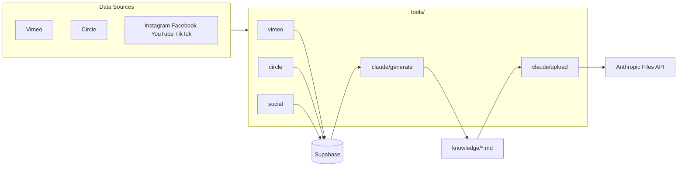

# TAT Assistant — Project Plan

## Mission

TAT Assistant is the central knowledge engine for The Audition Technique (TAT) universe. Its mission is to keep the AI assistant permanently and automatically up to date with everything Greg Apps teaches — across video content, live streams, the Circle community, and social media.

- **Automation:** The app continuously pulls content from Vimeo (course and blog videos), Circle (community posts and discussions), and social platforms (Instagram, Facebook, YouTube, TikTok), stores it in a cloud database, and consolidates it into structured knowledge documents uploaded directly into the TAT Claude project.
- **Refresh cadence:** Every six hours, without any manual effort, the assistant's knowledge refreshes to reflect Greg's latest teachings, community conversations, and audience engagement.
- **Goal:** Anyone on the TAT team should be able to ask the assistant a question about Greg's methodology, content, or community — and get an answer grounded in the real, current body of work.

---

## Architecture Overview



- **5-step pipeline:** vimeo → circle → social → generate → upload
- Each step is independent; failures are logged but do not stop the pipeline
- Incremental sync via watermarks (`posted_at`)

---

## Website & Business Context

The [business/](business/) folder contains Markdown documents that define TAT’s website content, offer structure, and business model. These docs guide the assistant’s answers about products, pricing, and strategy.

| Doc | Purpose |
|-----|---------|
| [value-ladder.md](business/value-ladder.md) | Product ladder: free → low → mid → high → premium |
| [revenue-model.md](business/revenue-model.md) | Income streams, MRR, revenue goals |
| [content-strategy.md](business/content-strategy.md) | Platforms (IG, YouTube, email, podcast), pillars, repurposing |
| [brand-messaging.md](business/brand-messaging.md) | Mission, vision, values, target audience, voice |
| [course-curriculum.md](business/course-curriculum.md) | Active and planned courses, modules, lessons |
| [membership-site.md](business/membership-site.md) | Tiers, content library, retention |
| [support-system.md](business/support-system.md) | Channels, onboarding, FAQs |
| [launch-campaigns.md](business/launch-campaigns.md) | Campaign planning and post-mortems |
| [team.md](business/team.md) | Roles, responsibilities, contact |
| [questionnaire.md](business/questionnaire.md) | Business strategy Q&A (source of truth) |
| [Circle/free-content.md](business/Circle/free-content.md) | Free content space in Circle |

These files are authored in-repo and can be included in knowledge uploads or used as reference when refining prompts so the assistant speaks consistently with TAT’s offers and messaging.

---

## Knowledge Documents (Output)

| File | Content | Window |
|------|---------|--------|
| `transcripts_core.md` | Website Videos, Blogs, Newsletter | All time |
| `transcripts_livestreams.md` | Livestreams, Insta Lives | All time |
| `community_circle.md` | Circle posts + comments | 90 days (configurable) |
| `social_feed.md` | Social posts + top comments | 90 days (configurable) |

---

## Setup Status

Tasks to complete before the app is fully operational. See [userinput/usertasks.md](userinput/usertasks.md) for detailed instructions.

### 1. Supabase (Database)

- [ ] Create a free project at https://supabase.com
- [ ] Go to SQL Editor, paste the contents of `data/schema.sql` and run it
- [ ] Go to Project Settings → API and copy Project URL → `SUPABASE_URL`, service_role key → `SUPABASE_SERVICE_KEY`

### 2. Anthropic / Claude

- [ ] Generate an API key at https://console.anthropic.com → `ANTHROPIC_API_KEY`
- [ ] Open the TAT Claude project and copy the ID from the URL → `CLAUDE_PROJECT_ID`

### 3. Vimeo

- [ ] Go to https://developer.vimeo.com/apps and create or open an app
- [ ] Generate a Personal Access Token with the `private` scope → `VIMEO_ACCESS_TOKEN`

### 4. Circle

- [ ] In Circle dashboard go to Settings → API and generate a token → `CIRCLE_API_TOKEN`
- [ ] Note your community subdomain → `CIRCLE_COMMUNITY_SLUG`
- [ ] Optionally note specific Space IDs → `CIRCLE_SPACE_IDS`

### 5. Instagram & Facebook (Meta Graph API)

- [ ] Create app at https://developers.facebook.com (type: Business)
- [ ] Add Instagram Graph API and Pages API products
- [ ] Connect TAT Facebook Page and Instagram account
- [ ] Generate long-lived Page Access Token, copy Page ID and Instagram Account ID

### 6. YouTube

- [ ] Create project at https://console.cloud.google.com
- [ ] Enable YouTube Data API v3
- [ ] Create API key → `YOUTUBE_API_KEY`
- [ ] Copy TAT YouTube Channel ID → `YOUTUBE_CHANNEL_ID`

### 7. TikTok (optional)

- [ ] Apply for TikTok Research API access at https://developers.tiktok.com
- [ ] Once approved, generate access token → `TIKTOK_ACCESS_TOKEN`

### 8. Local .env file

- [ ] Copy `.env.example` to `.env`
- [ ] Fill in all values gathered above

### 9. GitHub Secrets (for automated sync)

- [ ] Add each variable from `.env` as a repository secret
- [ ] Trigger the workflow manually once to verify

### 10. First local test run

- [ ] Run `pip install -r requirements.txt`
- [ ] Run `python run_sync.py --full --skip-upload`
- [ ] Check `knowledge/` for 4 generated `.md` files
- [ ] Run `python run_sync.py --full` for full run including Claude upload

---

## Web Interface (Streamlit)

A Streamlit app (`streamlit_app.py`) provides two tabs:

| Tab | Purpose |
|-----|---------|
| **Chat** | Ask questions answered from Greg's content via the Anthropic Files API |
| **Data** | Browse all content in Supabase — transcripts by category, Circle posts, social posts |

**Architecture:** The chat tab loads the current file IDs from `claude_sync_log` in Supabase, then sends each user message to the Claude API with all knowledge documents attached as `document` blocks. The data tab queries Supabase directly and renders the results.

**Running locally:**
```bash
.venv/bin/streamlit run streamlit_app.py
```

**Deploy:** Push to GitHub → connect to [Streamlit Cloud](https://streamlit.io/cloud) → auto-deploys. Add all `.env` variables as Streamlit secrets.

### Build Status
- [x] MVP — chat + data viewer (single file, local)
- [ ] Deploy to Streamlit Cloud
- [ ] Add conversation history persistence
- [ ] Add authentication for team access

---

## Roadmap / Planned Work

- [ ] Deploy Streamlit app to Streamlit Cloud
- [ ] Set up Circle and social sync (Facebook/Instagram tokens pending)
- [ ] Add GitHub Secrets so automated 6-hour sync runs
- [ ] Integrate `business/` docs into knowledge uploads
- [ ] Add conversation history to chat interface
- [ ] Add team authentication

---

## Related Docs

| Doc | Purpose |
|-----|---------|
| [README.md](README.md) | User-facing overview and value |
| [CLAUDE.md](CLAUDE.md) | Technical guidance for AI/developers |
| [plan.md](plan.md) | Project plan, architecture, roadmap, setup status |
| [business/](business/) | Website content, value ladder, revenue model, brand |
